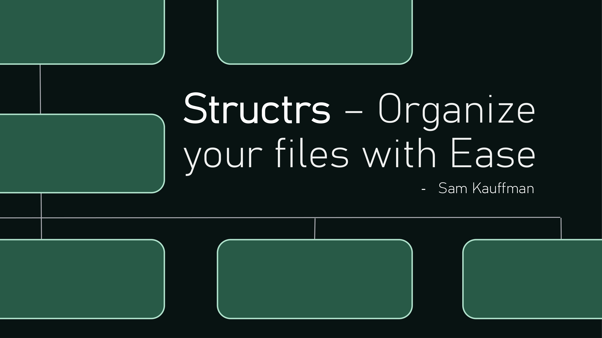
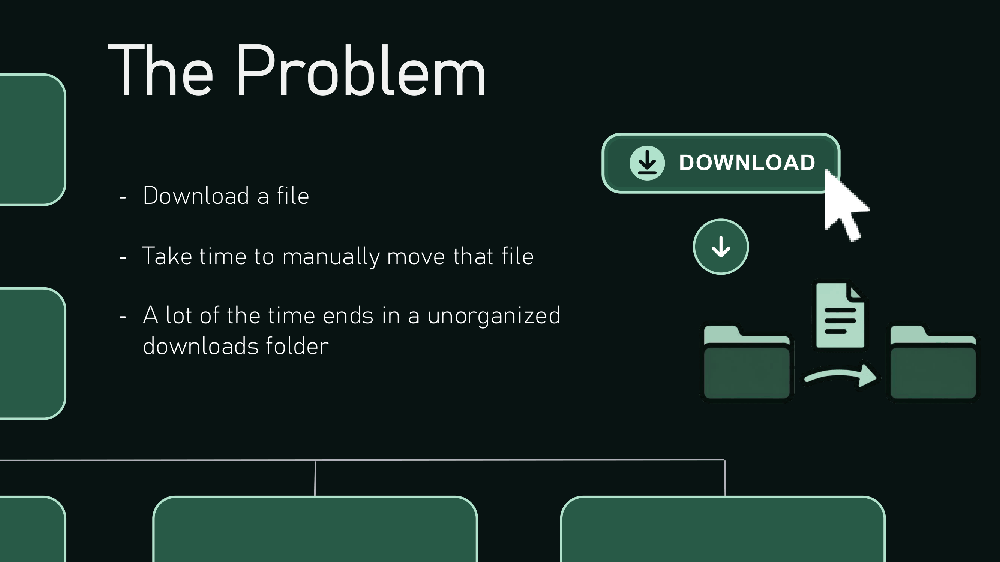
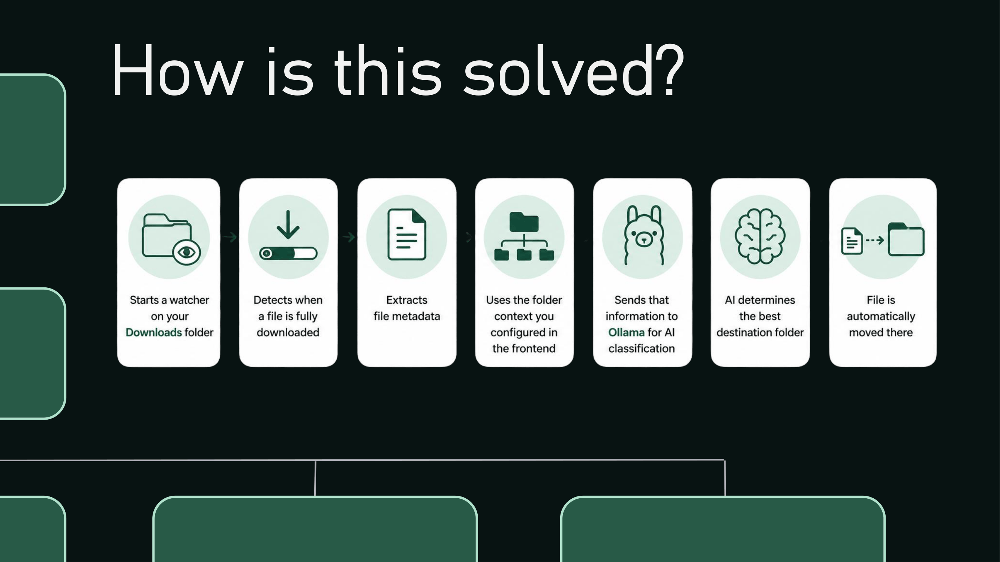
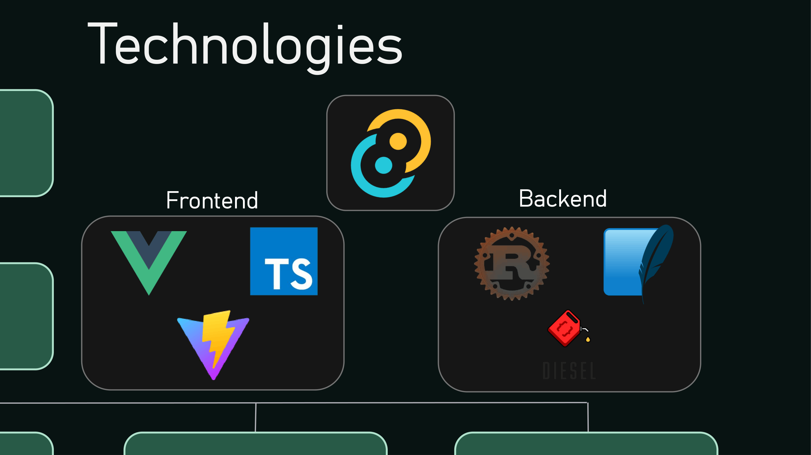
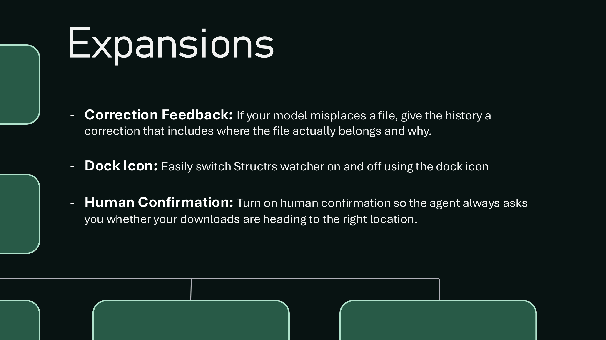

# Structrs








# Installation Guide

Follow these steps to set up and run the application locally after cloning the repository.

---

## Prerequisites

Ensure the following tools are installed on your machine before running the project.

### Node.js
Required for frontend dependencies.

Install Node.js: https://nodejs.org/

Verify installation:

```bash
node -v
npm -v
```

---

### Rust
Required for the Tauri backend.

Install Rust:

```bash
curl --proto '=https' --tlsv1.2 https://sh.rustup.rs -sSf | sh
```

Verify installation:

```bash
rustc --version
cargo --version
```

---

### Tauri System Dependencies

Install required dependencies for Tauri based on your operating system.

#### macOS

```bash
xcode-select --install
```

#### Windows

Install:

- Microsoft C++ Build Tools
- WebView2

#### Linux (Ubuntu/Debian)

```bash
sudo apt update
sudo apt install libwebkit2gtk-4.1-dev \
build-essential \
curl \
wget \
file \
libxdo-dev \
libssl-dev \
libayatana-appindicator3-dev \
librsvg2-dev
```

For additional platforms: https://tauri.app

---

### Diesel CLI

Required for managing database migrations.

```bash
cargo install diesel_cli --no-default-features --features sqlite
```

Verify installation:

```bash
diesel --version
```

---

# Clone Repository

```bash
git clone https://github.com/yourusername/your-repository.git
cd your-repository
```

---

# Install Dependencies

Install frontend dependencies:

```bash
npm install
```

---

# Database Setup

Create the SQLite database file:

```bash
touch app.db
```

Run database migrations:

```bash
diesel migration run
```

---

# Run Application

Start the application in development mode:

```bash
npm run tauri dev
```

This command will:

- Start the Vite development server
- Launch the Tauri desktop application
- Compile the Rust backend

---

# Build Application

To create a production build:

```bash
npm run tauri build
```

Compiled files will be located in:

```bash
src-tauri/target/release/
```

---

# Troubleshooting

## Migration Issues

If migrations fail:

```bash
diesel setup
diesel migration run
```

---

## Node Dependency Issues

If package installation fails:

```bash
rm -rf node_modules package-lock.json
npm install
```

---

## Tauri Build Issues

Check official Tauri setup documentation:

https://tauri.app/start/prerequisites/

---

# Tech Stack

### Frontend
- Vue.js
- TypeScript
- Tailwind CSS
- Vite

### Backend
- Rust
- Tauri

### Database
- SQLite
- Diesel


## Recommended IDE Setup

- [VS Code](https://code.visualstudio.com/) + [Vue - Official](https://marketplace.visualstudio.com/items?itemName=Vue.volar) + [Tauri](https://marketplace.visualstudio.com/items?itemName=tauri-apps.tauri-vscode) + [rust-analyzer](https://marketplace.visualstudio.com/items?itemName=rust-lang.rust-analyzer)

